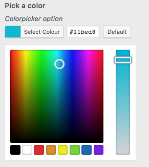

## Description ##
Acid is a WordPress theme options framework that allows developers and designers to create theme options in the WordPress Customizer API
with very little effort. This framework takes all the stress away from managing theme options, and allows you to focus more on developing your theme,
rather than spending endless hours creating and managing your theme options.

Acid includes all the default WordPress Customizer API options, and over time, we will be adding more custom options that fully adhere to the WordPress.org
theme check requirements. 

## Installation ##
To use Acid, simply bundle it in your theme. This framework is GPL-compatible, allowing you to include it in your theme whether you're creating fee themes on 
WordPress.org, Themeforst, Mojo or selling your themes privately. This tool is intended for use by developers, designers and theme creators.

1. Download the latest release of this framework, or click the download button to download as a zip.
2. Place the entire unzipped folder in your theme's `inc` folder. For example:
```wp-contents/themes/YOUR_THEME/inc/Acid```
3. In your theme's functions.php file (or in any file in your theme where you want to add the code for your theme's options), include the framework's main file like so:
```include_once get_stylesheet_directory() . '/inc/Acid/acid.php';```
4. Sample code
``` PHP

/**
*
* $acid_location is where the Acid folder is located in your theme
* In this scenaario, the Acid folder is located in wp-contents/themes/YOUR_THEME/inc
* 
* It is important to specify the location properly so that Acid knows the location of the assets it needs to look and function correctly
* 
*/

$acid_location = get_stylesheet_directory_uri() . '/inc/'; 
$acid = acid_instance( $acid_location );

/**
*
* Create your theme options as PHP arrays
* WordPress Customizer's structure allows you to create Options that are nested in Sections, which are in turn nested in Panels
* 
* Acid uses the same structure, allowing you to nest options easily, without needing to reference the section or panel ID
*
*/
$data = array (
    
    'panels'    => array(
        
        NULL      => array(
            
            'sections'       => array(
                
                'title_tagline'     => array(
                    
                    'title'         => __( 'first sample section', 'theme-slug' ),
                    'description'   => __( 'desc in first sample', 'theme-slug' ),
                    
                    'options'       => array(
                        
                        'toggle-sample'     => array(
                            
                            'label'     => __( 'Toggle on or off', 'theme-slug' ),
                            'type'      => 'toggle',
                            'default'   => false
                            
                        ),

                        'image-sample'      => array(
                            
                            'label'     => __( 'select an image', 'theme-slug' ),
                            'type'      => 'radio-image',
                            'choices'   => array(
                                array(
                                    'label'    => __( 'guy running', 'theme-slug' ),
                                    'url'       => AcidConfig::assets_url() . 'images/smartcat-icon.jpg',
                                ),
                                array(
                                    'label'    => __( 'couple', 'theme-slug' ),
                                    'url'       => AcidConfig::assets_url() . 'images/smartcat-icon.jpg',
                                ),
                                array(
                                    'label'    => __( 'guy running', 'theme-slug' ),
                                    'url'       => AcidConfig::assets_url() . 'images/smartcat-icon.jpg',
                                ),
                            ),
                            
                        ),
                        
                        'range-sample'      => array(
                            
                            'label'     => __( 'Opacity %' , 'theme-slug' ),
                            'type'      => 'range',
                            'default'   => 20,
                            'min'       => 0,
                            'max'       => 100,
                            'step'      => 1
                            
                        ),
                        
                        'sortable-sample'   => array(
                            'label'     => __( 'Sortable links', 'theme-slug' ),
                            'type'      => 'sortable',
                        ),        
                        
                    ),
                ),   
            ),  
        ),
        
        'another-panel'     => array(
            
            'title'         => __( 'Another Panel', 'theme-slug' ),
            'description'   => __( 'This is another panel', 'theme-slug' ),

            'sections'          => array(

                'demo-section'      => array(
                    
                    'title'         => __( 'Section title', 'theme-slug' ),
                    'description'   => __( 'This is another section demo', 'theme-slug' ),

                    'options'       => array(

                        'demo-color'        => array(
                            'label'         => __( 'Pick a color', 'theme-slug' ),
                            'description'   => __( 'Colorpicker option', 'theme-slug' ),
                            'type'          => 'color',
                            'default'       => __( '#cc0000', 'theme-slug' )

                        ),

                        'demo-text'         => array(
                            'label'         => __( 'Enter your title', 'theme-slug' ),
                            'description'   => __( 'Create any text, HTML is not allowed', 'theme-slug' ),
                            'type'          => 'text',
                            'default'       => __( 'Created with Acid Framework', 'theme-slug' )

                        ),

                        'demo-image'        => array(
                            'label'         => __( 'Upload an image', 'theme-slug' ),
                            'description'   => __( 'Allow users to select an image or upload a new one', 'theme-slug' ),
                            'type'          => 'image',

                        ),
                        
                        'image-sample'      => array(
                            
                            'label'     => __( 'select an image', 'theme-slug' ),
                            'type'      => 'radio-image',
                            'choices'   => array(
                                array(
                                    'label'    => __( 'guy running', 'theme-slug' ),
                                    'url'       => AcidConfig::assets_url() . 'images/smartcat-icon.jpg',
                                ),
                                array(
                                    'label'    => __( 'couple', 'theme-slug' ),
                                    'url'       => AcidConfig::assets_url() . 'images/smartcat-icon.jpg',
                                ),
                                array(
                                    'label'    => __( 'guy running', 'theme-slug' ),
                                    'url'       => AcidConfig::assets_url() . 'images/smartcat-icon.jpg',
                                ),
                            ),
                            
                        ),

                        'demo-url'          => array(

                            'label'         => __( 'Enter a URL', 'theme-slug' ),
                            'description'   => __( 'Descriptions are optional', 'theme-slug' ),
                            'type'          => 'url',
                            'default'       => 'https://acidframework.com'

                        ),

                        'demo-number'       => array(

                            'label'         => __( 'Enter a Number', 'theme-slug' ),
                            'description'   => __( 'Numeric value only', 'theme-slug' ),
                            'type'          => 'number',
                            'default'       => 10,
                            'min'           => 0,
                            'max'           => 100,
                            'step'          => 5

                        ),

                        'demo-range'        => array(

                            'label'         => __( 'Enter a Number', 'theme-slug' ),
                            'description'   => __( 'Numeric value only', 'theme-slug' ),
                            'type'          => 'range',
                            'default'       => 10,
                            'min'           => 0,
                            'max'           => 100,
                            'step'          => 5

                        ),
                        
                        'demo-textarea'         => array(
                            'label'         => __( 'Enter text', 'theme-slug' ),
                            'description'   => __( 'Create any text, HTML is not allowed', 'theme-slug' ),
                            'type'          => 'textarea',
                            'default'       => __( 'Created with Acid Framework', 'theme-slug' )

                        ),
                        
                        'demo-date'         => array(
                            'label'         => __( 'Enter a date', 'theme-slug' ),
                            'type'          => 'date',
                            'default'       => '2018-03-16'

                        ),
                        
                        'demo-checkbox'         => array(
                            'label'         => __( 'Yes or no ?', 'theme-slug' ),
                            'description'   => __( 'Use this control for options that are togglelable', 'theme-slug' ),
                            'type'          => 'checkbox',
                            'default'       => false

                        ),
                        
                        'demo-toggle'       => array(
                            'label'         => __( 'On or Off ?', 'theme-slug' ),
                            'description'   => __( 'Same as a checkbox, but looks more cool', 'theme-slug' ),
                            'type'          => 'toggle',
                            'default'       => true

                        ),
                        
                        'demo-radio'        => array(
                            'label'         => __( 'Select one of many', 'theme-slug' ),
                            'description'   => __( 'Limits user to one selection', 'theme-slug' ),
                            'type'          => 'radio',
                            'default'       => 'red',
                            'choices'       => array(
                                'red'       => __( 'Red', 'theme-slug' ),
                                'blue'      => __( 'Blue', 'theme-slug' ),
                                'green'     => __( 'Green', 'theme-slug' ),
                                'purple'    => __( 'purple', 'theme-slug' ),
                            ),

                        ),
                        
                        'demo-select'       => array(
                            'label'         => __( 'Select from dropdown', 'theme-slug' ),
                            'type'          => 'select',
                            'default'       => 'purple',
                            'choices'       => array(
                                'red'       => __( 'Red', 'theme-slug' ),
                                'blue'      => __( 'Blue', 'theme-slug' ),
                                'green'     => __( 'Green', 'theme-slug' ),
                                'purple'    => __( 'purple', 'theme-slug' ),
                            ),

                        ),
                        
                        'demo-pages'        => array(
                            'label'         => __( 'Select a page', 'theme-slug' ),
                            'type'          => 'dropdown-pages',

                        ),
                        
                        'demo-email'        => array(
                            'label'         => __( 'Enter email address', 'theme-slug' ),
                            'type'          => 'email',
                            'default'       => get_option( 'admin_email' ),

                        ),

                    ),
                                        
                ),

            ),

        ),
    ),
);

$acid->config( $data );
```

## Controls ##

### Color Picker ###

```
'demo-color'        => array(
    'label'         => __( 'Pick a color', 'theme-slug' ),
    'description'   => __( 'Colorpicker option', 'theme-slug' ),
    'type'          => 'color',
    'default'       => __( '#cc0000', 'theme-slug' )

),
```



## Credits ##

1. Customizer Range Control 
    https://github.com/soderlind/class-customizer-range-value-control
    MIT

2. Radio Image Control
    https://gist.github.com/justintadlock/2a9e3312a6fe10e8dc28
    http://www.gnu.org/licenses/old-licenses/gpl-2.0.html
    GPL

3. Toggle Control
    https://github.com/soderlind/class-customizer-toggle-control
    http://www.gnu.org/licenses/old-licenses/gpl-2.0.html
    GPL


